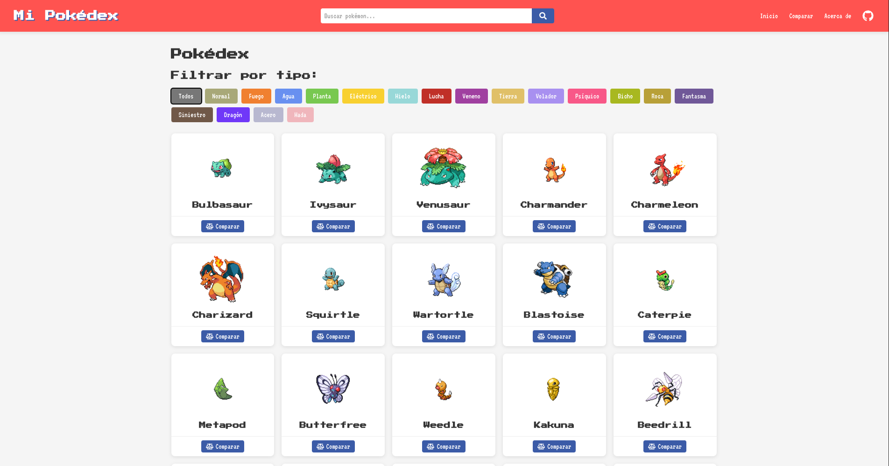
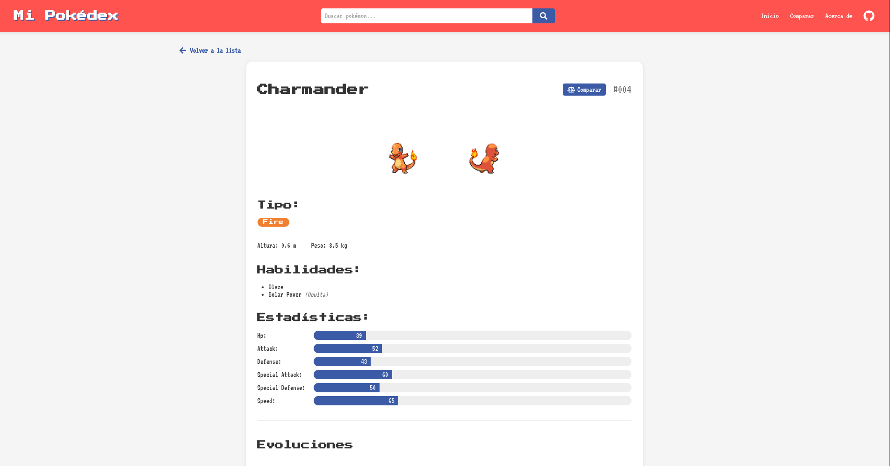
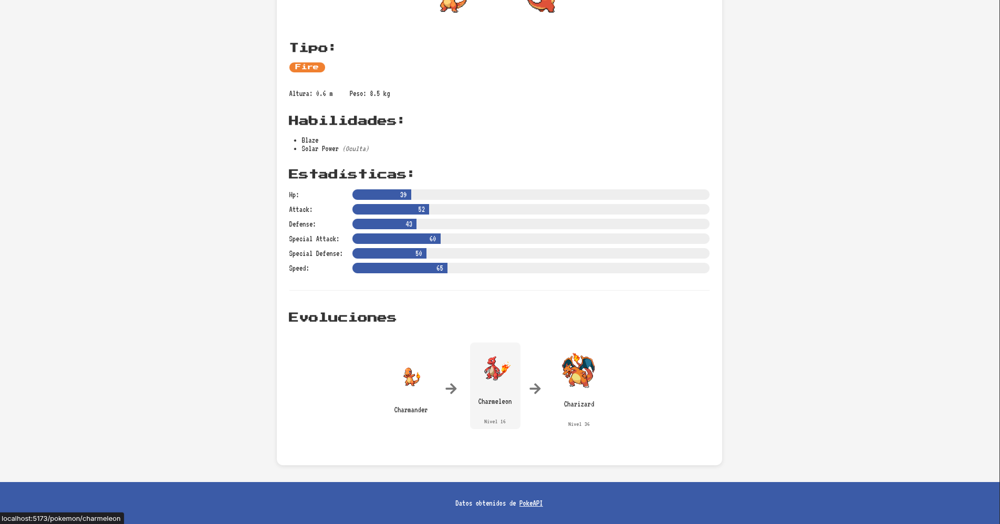
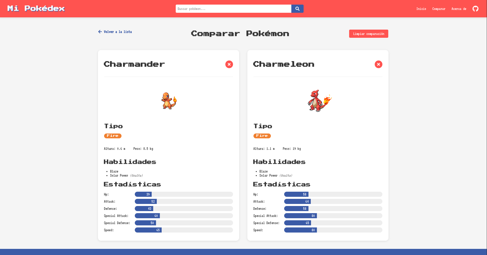

<p align="center">
  
</p>

Una aplicación web desarrollada con React y Vite que consume la API de Pokémon (PokeAPI) para mostrar información detallada sobre los Pokémon y sus características.

## 📸 Demostración

<p align="center">
  
  <p align="center"><em>Página principal con listado de Pokémon y filtrado por tipo</em></p>
  
  
  <p align="center"><em>Página de detalle mostrando estadísticas, habilidades y tipos</em></p>
  
  
  <p align="center"><em>Visualización de la cadena evolutiva de cada Pokémon</em></p>
  
  
  <p align="center"><em>Herramienta de comparación para analizar dos Pokémon lado a lado</em></p>
</p>

## ✨ Características

- **Listado de Pokémon**: Visualización de todos los Pokémon con paginación
- **Página de detalles**: Información detallada de cada Pokémon (estadísticas, habilidades, tipo, etc.)
- **Búsqueda de Pokémon**: Busca cualquier Pokémon por nombre
- **Filtrado por tipo**: Filtra los Pokémon según su tipo (fuego, agua, planta, etc.)
- **Visualización de evoluciones**: Muestra la cadena evolutiva completa de cada Pokémon
- **Comparación de Pokémon**: Compara las estadísticas entre dos Pokémon diferentes
- **Diseño Responsivo**: Adaptado para dispositivos móviles y escritorio
- **Tipografía Retro**: Utiliza fuentes que emulan el estilo de los juegos clásicos de Pokémon

## 🛠️ Tecnologías Utilizadas

- **React**: Biblioteca para construir la interfaz de usuario
- **Vite**: Entorno de desarrollo rápido
- **React Router**: Navegación entre páginas
- **Axios**: Cliente HTTP para realizar peticiones a la API
- **React Icons**: Iconos para la interfaz
- **CSS puro**: Estilos sin frameworks adicionales

## 🚀 Instalación y Uso

1. Clona este repositorio:

```bash
git clone https://github.com/NoeOnDev/mi-pokedex.git
```

2. Navega hasta la carpeta del proyecto:

```bash
cd mi-pokedex
```

3. Instala las dependencias:

```bash
npm install
```

4. Ejecuta la aplicación en modo desarrollo:

```bash
npm run dev
```

5. Abre [http://localhost:5173](http://localhost:5173) para verla en el navegador.

## 📦 Estructura del Proyecto

```
src/
  components/         # Componentes reutilizables
    CompareButton.jsx
    EvolutionChain.jsx
    MobileMenu.jsx
    Pagination.jsx
    PokemonCard.jsx
    PokemonDetail.jsx
    PokemonList.jsx
    SearchBar.jsx
    TypeFilter.jsx
  contexts/           # Contextos para estado global
    CompareContext.jsx
  pages/              # Páginas principales
    AboutPage.jsx
    ComparePage.jsx
    DetailPage.jsx
    HomePage.jsx
  services/           # Servicios y llamadas a API
    pokemonService.js
  App.jsx             # Componente principal y rutas
  index.css           # Estilos globales
  main.jsx            # Punto de entrada
```

## 🔄 API Utilizada

Esta aplicación consume la [PokeAPI](https://pokeapi.co/), una API RESTful gratuita y completa con información sobre el universo Pokémon.

Endpoints principales utilizados:

- `/pokemon`: Lista de Pokémon
- `/pokemon/{name}`: Detalles de un Pokémon específico
- `/type/{id}`: Pokémon por tipo
- `/pokemon-species/{id}`: Información sobre especies de Pokémon
- `/evolution-chain/{id}`: Cadenas evolutivas

## 🎮 Funcionalidades Adicionales

- **Modo Responsivo**: Menú hamburguesa en dispositivos móviles
- **Diseño Temático**: Colores y estilos inspirados en los juegos de Pokémon
- **Fuentes Pixeladas**: 'Press Start 2P' y 'VT323' para recrear la estética de videojuegos retro
- **Visualización de Evoluciones**: Representación visual de cómo evolucionan los Pokémon

## 👨‍💻 Autor

**Noé Alejandro Rodríguez Moto**

- GitHub: [@NoeOnDev](https://github.com/NoeOnDev)

## 🙏 Agradecimientos

- [PokeAPI](https://pokeapi.co/) por proporcionar una API completa y gratuita
- [React](https://reactjs.org/) y [Vite](https://vitejs.dev/) por hacer posible el desarrollo de esta aplicación
- Comunidad de desarrolladores por recursos y tutoriales

---

<p align="center">
  Desarrollado con ❤️ y código por Noé Alejandro Rodríguez Moto
</p>
